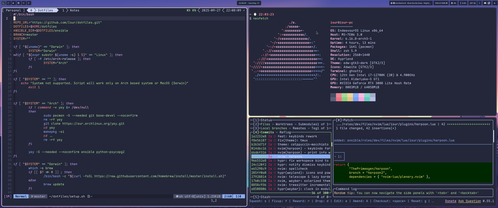

# Dotfiles

Dotfiles here includes everything I need on my machines.

Everything is collected into ansible playbook and roles.

Two playbooks:
- `play.yml` - install and setup everything
- `repos.yml` - just clone some personal repositories

## Supported systems

Ansible roles are prepared to be used with Archlinux and Darwin systems.

- arch based;
- mac os (darwin);

### Tested on

- endeavouros;
- mac os;

## Includes

- dotfiles (configs);
- scripts;
- applications installation;
- secrets;
- wallpapers;

### Scripts

Those scripts will be installed:

- `backup` - backup script that will be used to backup my data to external drive;
- `keker` - automatically create directory for new project - template might be used for this;
- `updater` - update dotfiles repo, packages and `Oh My ZSH`;
- `tmux-sessionizer` - create tmux session in selected directory;
- `tmux-fzf` - search in tmux window (used in tmux floating window);
- `wallchange` - change to random wallpaper in hyprland;

### Secrets

Hidden with `ansible-vault`:
- `ssh` - keys & config;

## Requirements

- `sudo` privileges;
- `.vault_pass` file with password (required for ssh and other secrets) in `$HOME/.vault_pass` (when running helper script, required to run playbook - using directly can be used in other ways);

## Helpers

### Personal

This script will install evertyhing that is required before using ansible playbook and will run this playbook.

```sh
bash -c "$(curl https://raw.githubusercontent.com/isur/dotfiles/master/setup.sh)"
```

### Server

Install some tools that I use on servers:

```sh
bash -c "$(curl https://raw.githubusercontent.com/isur/dotfiles/master/server.sh)"
```

## Preview
Hyprland


