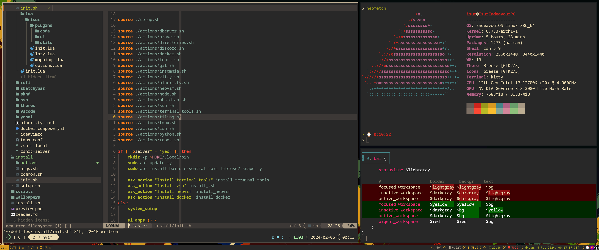

# Dotfiles

Dotfiles that are included here with auto installation of everything that is needed.

## Supported systems

- arch based;
- debian based;
- mac os;

### Tested on

- manjaro;
- endeavouros;
- ubuntu;
- mac os;
- ubuntu server (server install script);

## Includes

- configs;
- scripts;
- applications installation;
- secrets;
- wallpapers;

### Configs

- `i3wm` - window manager;
- `alacritty` and `kitty` - terminal;
- `zsh` - shell;
- `tmux` - terminal multiplexer;
- `neovim`, `ideavim`, `vscode` - text editors;
- `ssh`;
- `git`;

### Scripts

Those scripts will be installed:

- `keker` - automatically create directory for new project - template might be used for this;
- `updater` - update packages with `yay`/`brew`/`apt` and `Oh My ZSH`;
- `tmux-sessionizer` - create tmux session in selected directory;

### Secrets

Hidden with `ansible-vault`:
- `ssh` - keys;
- urls to repositories;

## Requirements

- `sudo` privileges;
- `git` installed;
- `.vault_pass` file with password (required for ssh and other secrets) in `$HOME/dotfiles/.vault_pass`;

## Installing

Running script will:

- setup directory structure;
- clone repositories for work and private;
- download fonts;
- setup ssh configs;
- install applications;

Some stuff might be required to configure manually - like dbeaver connections, fonts for some apps, login etc.

Package manager used for installing depends on system:

- macos - `homebrew`;
- debian based - `apt` and `snap`;
- arch based - `yay`;

## Helpers

```sh
bash -c "$(curl https://raw.githubusercontent.com/Isur/dotfiles/refs/heads/ansible/ansible/setup.sh)"
```

`./install.sh` - will install everything thats needed and configure symlinks;
`./install/server.sh` - will install some tools that I use on servers;

### Server

Install some tools that I use on servers:

```sh
bash -c "$(curl https://raw.githubusercontent.com/isur/dotfiles/master/install/server.sh)"
```

This will install:
- zsh;
- fzf;
- ripgrep;
- fd-find;
- curl;
- vim;
- docker and lazydocker;

## Preview
i3wm


