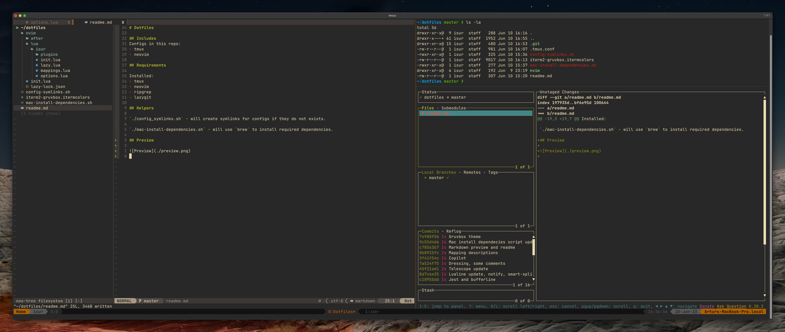

# Dotfiles

Dotfiles that are included here with auto installation of everything that is needed.

Systems that are supported:

- arch based
- debian based
- mac os

Tested on:

- manjaro
- endeavouros
- ubuntu
- mac os
- ubuntu server

## Includes

Configs in this repo:

- tmux
- neovim
- btop
- zsh
- kitty
- git
- lazygit
- ideavim
- vscode
- ssh

## Requirements

- `sudo` privileges.
- `git` installed.
- `.vault_pass` file with password (required for ssh and other secrets) in `$HOME/dotfiles/.vault_pass`

## Scripts

With those configs and dotfiles comes custom scripts:

- `keker` - automatically create directory for new project - template might be used for this
- `updater` - update packages with `yay`/`brew`/`apt` and `Oh My ZSH`
- `tmux-sessionizer` - create tmux session in selected directory

## Installing

Install script will install and configure:

- Directory structure
- repositories for work and private
- fonts
- ssh configs
- `dbeaver`
- `docker`
- `lazygit`
- `git-delta`
- `insomnia`
- `kitty`
- `neovim`
- `node`, `npm`, `pnpm`
- `ripgrep`
- `fd`
- `fzf`
- `btop`
- `tmux`
- `gnu-sed`
- `zsh`
- `ansible`

Some stuff might be required to configure manually - like dbeaver connections, fonts for some apps, login etc.

Package manager used for installing depends on system:

- macos - `homebrew`
- debian based - `apt` and `snap`
- arch based - `yay`

## Helpers

`./install.sh` - will install everything thats needed and configure symlinks.

## Server

Install some tools that I use on servers:

```sh
bash -c "$(curl https://raw.githubusercontent.com/isur/dotfiles/master/install/server.sh)"
```

This will install:
- zsh
- fzf
- ripgrep
- fd-find
- curl
- vim
- docker and lazydocker

## Preview

### Mac
Yabai and sketchbar



### Linux
i3wm


