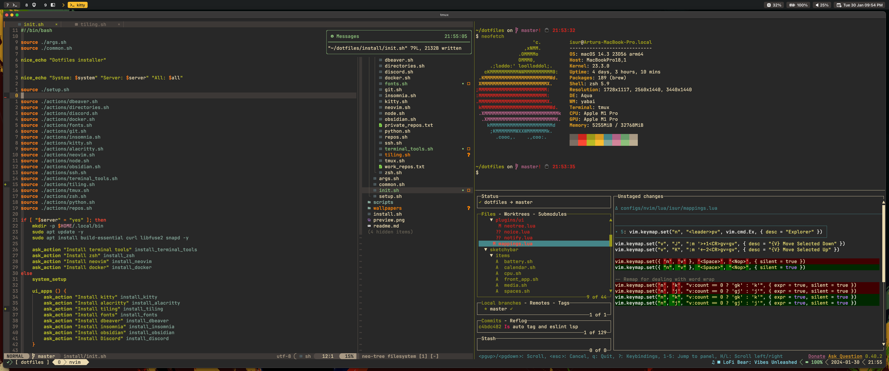

# Dotfiles

## Includes
Configs in this repo:
- tmux
- neovim
- btop

## Requirements

Installed:
- tmux
- neovim
- ripgrep
- lazygit
- btop

## Helpers

`./config_symlinks.sh` - will create symlinks for configs if they do not exists.

`./mac-install-dependencies.sh` - will use `brew` to install required dependencies.

## Preview

